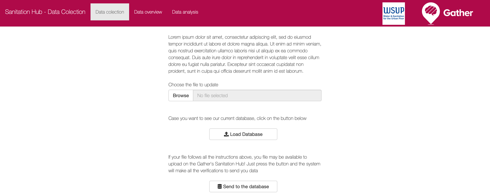
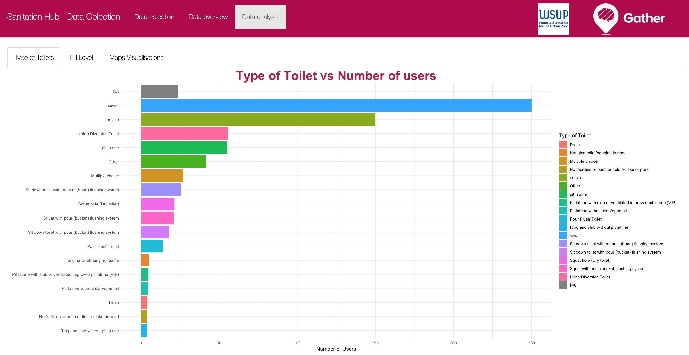
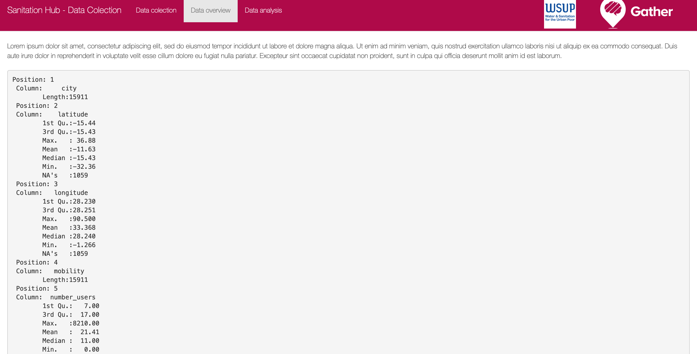

# Sanitation Hub

1. [Problem / Situation](#prob) 
2. [General Description](#gen)
2. [Usage](#use)
3. [User Interface](#UI)
4. [Next Steps](#next)
5. [Final Considerations](#final)

***

## Problem / Situation 

The concern of improving sanitation on third world countries is slowly growing, with each organization trying to research and collect data on emerging countries. But on the sanitation area, the organisations tends to neglect the expanse of their research, focusing only on small areas of colection, like one county or city. To improve the sanitation in a whole continent is necessary to aggregate all these organizations' efforts into one for a greater good, that is when the Sanitation Hub enters in action.

## General Description

The Sanitation Hub is a Upload and Analysis platform, that helps organizations to unite their data to a global database and analyse it on a more continental way. The platform also has its own analysis area, where it can be possible to observe insights from your data or from the connected database.

This project is recomendable for organizations that have interest on sharing their sanitation datasets to make a more complete database that helps governments and companies to create and update the sanitation infrastructure across the world.

## Usage 

This application is avaiable at Gatherhub platform and totally ready to operate, all the datasets are already included on the application, requiring no more effort from the user.

** STILL NEED TO POST THE LINK ON **

## User Interface

The image above represents the main page of the Sanitation Hub, showing three options: Load local data, Load Database and submit your data to the database, where:

* Load local data: Read files from your computer to the system
* Load Database: Read the Gather's database for analysis
* Submit your data: If you have your local data on the system, you can merge it with our database

To make your analysis and merging possible is necessary to follow this guide book about your dataset:

** Still have to make the Rules **
[Database Rules - Sanitation Hub](images/print1.png)

After following the rules, the analysis area should be available for use, that are is splitted in two regions: 

1. Data overview - shows the dataset atributes' statistics, like:
  * if textual, shows the quantity of not null values
  * if numeric, shows basic statistics of the data, like median, min and max values.
 
Below you can check the Data Overview sector:

  
  
2. Data Visualisation - visualise the dataset through graphs, which has the categories:
  * Barchart graphs
  * Piechart graphs
  * Map visualisation
  * Time-series graphs (if available)
 
Below you can see the Barchart and the Map analysis zones:

## Next Steps

## Final Considerations
